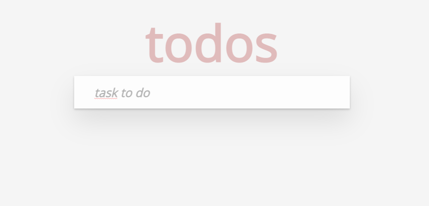
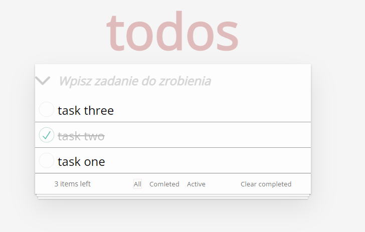
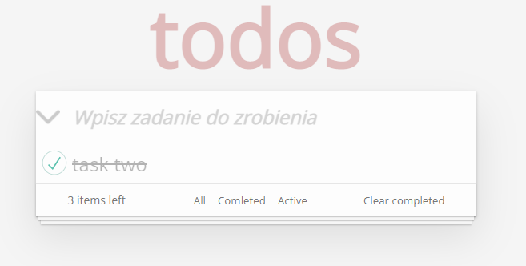
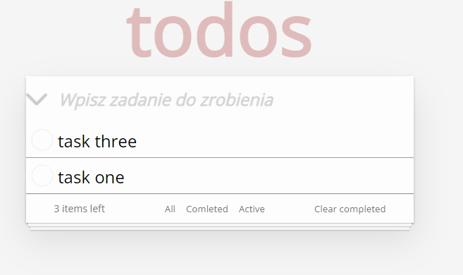
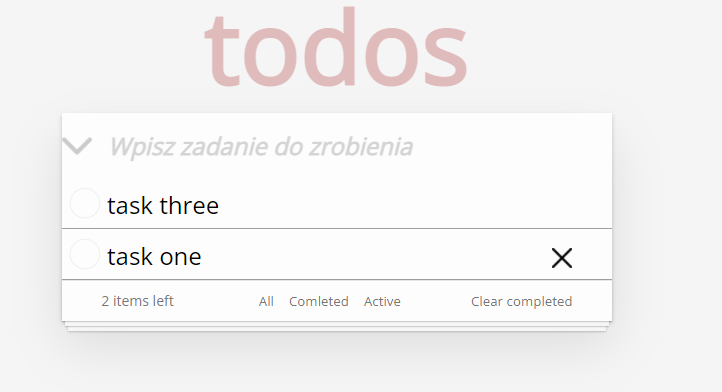

# Getting Started

This App is made for to help You to manage all kind of "Tasks"

## Adding Tasks

You can add task by entering the description of a particular task.

## Managing list of "Tasks"

You can manage your task by checking the box if completed.

## Manage your tasks

You can manage your tasks by checking if they are "Completed" or "Active" or you can look into "All" tab to see them all together.

"Completed" task:

"Active tasks":

## Deleting and Clearing the tasks

You can delete the task by pressing the "X" icon or you can also clear all cempleted tasks by pressing button.

